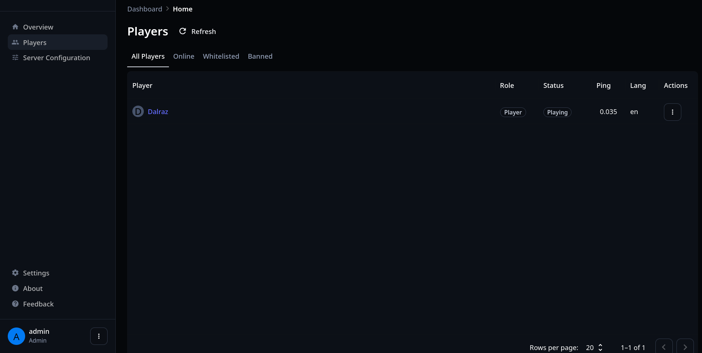

# GraniteServer

GraniteServer is a Vintage Story server mod that adds server and player administration, paired with a MUI-based React frontend for managing the server.

## Current Features

- **Player management**: Whitelist, ban, kick, and inventory management
- **Server configuration**: Change server settings from the web UI

## Screenshots

### Server Overview


### Server Configuration


### Players Management



### Player Overview


### Player Sessions


### Player Inventory


---

## Quickstart (Dev Container)

The recommended way to develop GraniteServer is using the included devcontainer in VS Code. This provides a pre-configured environment with all dependencies.

1. **Open in VS Code**

- Use "Open Folder in Container" or "Reopen in Container" if prompted.

2. **Build and run using the Run/Debug panel**

- Open the Run/Debug panel (Ctrl+Shift+D or click the Run icon in the sidebar).
- Choose a launch configuration, such as:
  - `Launch Server And ClientApp` (full server and client)
  - `Launch Server with UI Dev` (server with UI in dev mode)
  - `Launch Server (Postgres)` or `Launch Server (SQLite)` for specific DB setups
- Click the green play button to build and launch.

3. **Frontend only**
   - The compound launch config can start both server and UI, but you can also run the frontend alone using the `npm dev` task or manually:
     ```bash
     cd ClientApp
     npm install
     npm run dev
     ```
   - When running in dev mode, the frontend will be available at http://localhost:3000.
   - When running the server with the built-in client (via launch configs), the web UI is served from the mod on http://localhost:5000 (the mod's server port).

---

### Manual build and run (if not using VS Code launch configs)

You can also build and run manually:

```bash
# Build the server
dotnet build -c Debug GraniteServerMod/GraniteServerMod.csproj /p:BuildWebApp=true
# Run the server
dotnet run --project GraniteServerMod/GraniteServerMod.csproj -c Debug
# Frontend (in a separate terminal)
cd ClientApp
npm install
npm run dev
```

---

## Configuration

Configuration is stored in `graniteserverconfig.json` inside the mod directory and will be created automatically if missing. Environment variables prefixed with `GS_` can override any configuration property.

Key points:

- Switch database provider with `GS_DATABASETYPE` (`PostgreSQL` or `SQLite`).
- For PostgreSQL, set `GS_DATABASEHOST`, `GS_DATABASEPORT` (default `5432`), `GS_DATABASENAME`, `GS_DATABASEUSERNAME`, `GS_DATABASEPASSWORD`.
- For SQLite, set `GS_DATABASENAME` (default `graniteserver`) — the `.db` extension will be added automatically.

For development the Postgres service in the dev container is available as `GS_DATABASEHOST=db`.

---

## Docker Compose Examples

Below are example snippets showing how to run the container with SQLite or PostgreSQL. These examples are for development and demonstration only.

### SQLite (Simple)

```yaml
version: "3.8"

services:
  vintagestory:
    image: ghcr.io/kramins/vintagestory:latest
    ports:
      - "5000:5000" # Web UI/API (HTTP)
      - "42420:42420/tcp" # Game server (TCP)
      - "42420:42420/udp" # Game server (UDP)
    environment:
      GS_PORT: 5000
      GS_DATABASETYPE: "SQLite"
      GS_AUTHENTICATIONTYPE: "Basic"
      GS_JWTEXPIRYMINUTES: 60
      GS_USERNAME: "admin"
      GS_JWTSECRET: "your-secret-key-here"
      GS_PASSWORD: "your-password-here"
    volumes:
      - ./world-data:/data
```

### PostgreSQL (Development)

```yaml
version: "3.8"

services:
  vintagestory:
    image: ghcr.io/kramins/vintagestory:latest
    ports:
      - "5000:5000" # Web UI/API (HTTP)
      - "42420:42420/tcp" # Game server (TCP)
      - "42420:42420/udp" # Game server (UDP)
    environment:
      GS_PORT: 5000
      GS_DATABASETYPE: "PostgreSQL"
      GS_DATABASEHOST: "postgres"
      GS_DATABASEPORT: 5432
      GS_DATABASENAME: "graniteserver"
      GS_DATABASEUSERNAME: "postgres"
      GS_DATABASEPASSWORD: "your-postgres-password"
      GS_AUTHENTICATIONTYPE: "Basic"
      GS_JWTEXPIRYMINUTES: 60
      GS_USERNAME: "admin"
      GS_JWTSECRET: "your-secret-key-here"
      GS_PASSWORD: "your-password-here"
    volumes:
      - ./world-data:/data
    depends_on:
      - postgres

  postgres:
    image: postgres:16-alpine
    environment:
      POSTGRES_DB: graniteserver
      POSTGRES_USER: postgres
      POSTGRES_PASSWORD: your-postgres-password
    volumes:
      - postgres-data:/var/lib/postgresql/data
    ports:
      - "5432:5432"

volumes:
  postgres-data:
```

---

## Usage

GraniteServer is designed to work with the Kramins/container-vintagestory-server container, but it can also be used on a standalone Vintage Story server. For container usage, see that container's documentation.

## License

GPLv3
